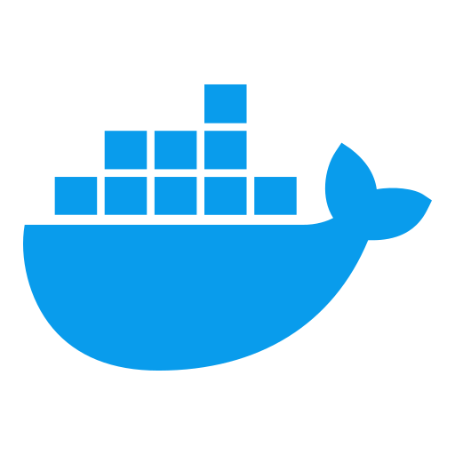

<h1 align="center">Welcome to my GitHub page!</h1>

<!--  -->

### Languages and Tools:

&nbsp;&nbsp;
&nbsp;&nbsp;
&nbsp;&nbsp;
<!-- &nbsp;&nbsp; -->
&nbsp;&nbsp;
&nbsp;&nbsp;
&nbsp;&nbsp;
&nbsp;&nbsp;
&nbsp;&nbsp;
&nbsp;&nbsp;
&nbsp;&nbsp;
&nbsp;&nbsp;
&nbsp;&nbsp;
&nbsp;&nbsp;
&nbsp;&nbsp;
&nbsp;&nbsp;
&nbsp;&nbsp;

 
 

### Waka Stats:

<!-- ### GitHub Stats: -->

<!--  -->

<!-- 

 -->
### Extra Pins

