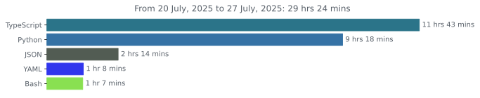

<!-- <h1 align="center">Welcome to my GitHub page!</h1> -->

<!--  -->
<!-- 

 -->

<!--  -->

# Hi there! Welcome to my Github page!

### Languages and Tools

&nbsp;&nbsp;
&nbsp;&nbsp;
&nbsp;&nbsp;
&nbsp;&nbsp;
&nbsp;&nbsp;
&nbsp;&nbsp;
&nbsp;&nbsp;
&nbsp;&nbsp;
&nbsp;&nbsp;
&nbsp;&nbsp;
&nbsp;&nbsp;
&nbsp;&nbsp;
&nbsp;&nbsp;

### Waka Stats

<!--
### Activity

### Most active weekdays

-->

<!-- ### GitHub Stats: -->

<!--  -->

<!-- 

 -->
<!-- ### Extra Pins -->

<!--

-->
